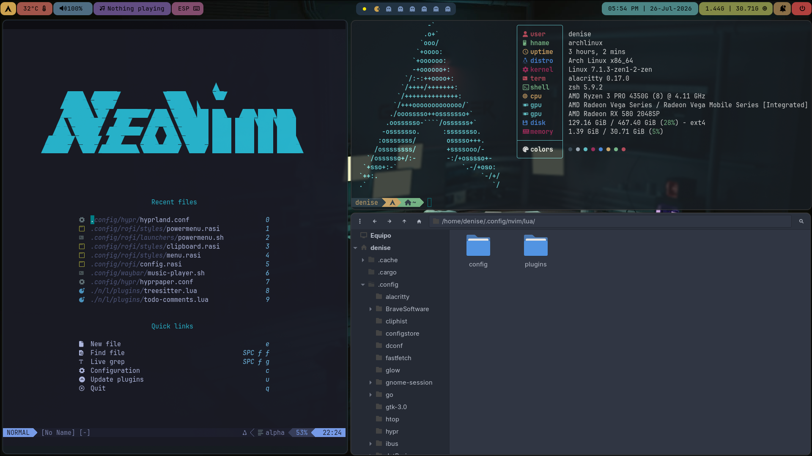
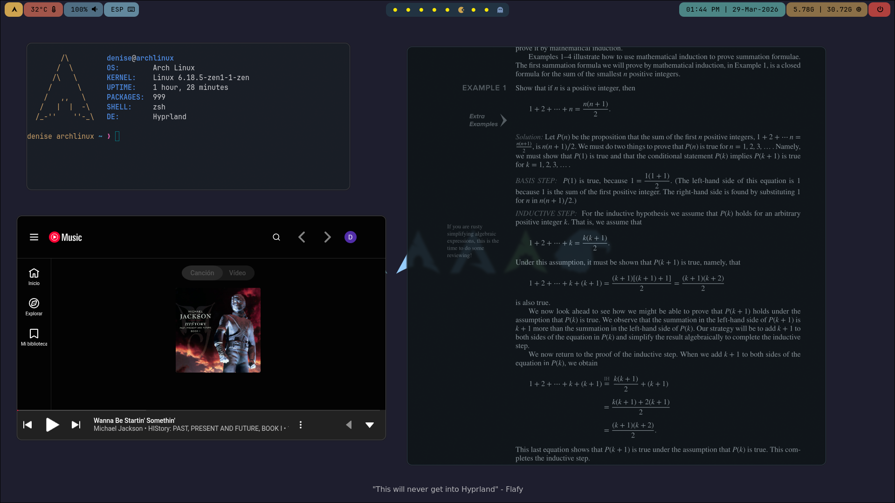
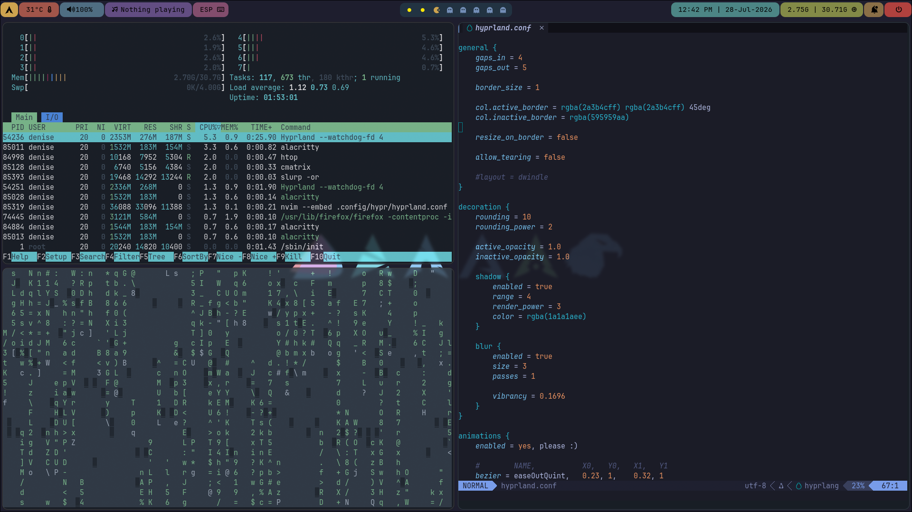

# My Personal Rice Hyprland

## Description
Personal Linux rice based on Arch Linux using Hyprland as the window manager.  
Focused on a minimal, clean, and functional workflow.

## Preview
| | |
|---|---|
|  |  |
|  |  |


## Core Components
- **WM:** Hyprland  
- **Theme:** Nord  
- **Terminal:** Alacritty  
- **Launcher:** Rofi  
- **Bar:** Waybar  
- **Editor:** Neovim (LazyVim)
- **Alternative Editor:** nano
- **PDF Viewer:** Zathura  
- **Shell:** zsh
- **Prompt Theme:** p10k

## CLI Tools
- **lsd** – modern replacement for ls  
- **bat** – cat with syntax highlighting  
- **fastfetch / ufetch** – system info tools  
- **htop** – process viewer  
- **cmatrix** – matrix effect  

## Firefox Extension
- **nightTab** – by zombieFox

## Repository Structure
- `alacritty/` → terminal configuration  
- `gsimplecal/` → calendar widget configuration  
- `hypr/` → Hyprland config  
- `nvim/` → Neovim (LazyVim) setup  
- `packages/` → packages installed  
- `rofi/` → launcher themes and config  
- `waybar/` → bar configuration  
- `zathura/` → PDF viewer config  

## Installation
Clone the repository:
```bash
git clone https://github.com/DeniseDiaz13/Arch-Linux-Rice.git
cd Rice
```

Copy configurations (example):
```bash
cp -r hypr ~/.config/
cp -r waybar ~/.config/
cp -r rofi ~/.config/
cp -r alacritty ~/.config/
...
cp .zshrc ~/
cp .nanorc ~/
cp .p10k.zsh ~/
```

## Notes
- Designed for Arch Linux  
- Some dependencies must be installed manually  
- Paths and configs may require adjustment depending on your system  

## Credits
Configurations and themes are adapted from various community sources.
